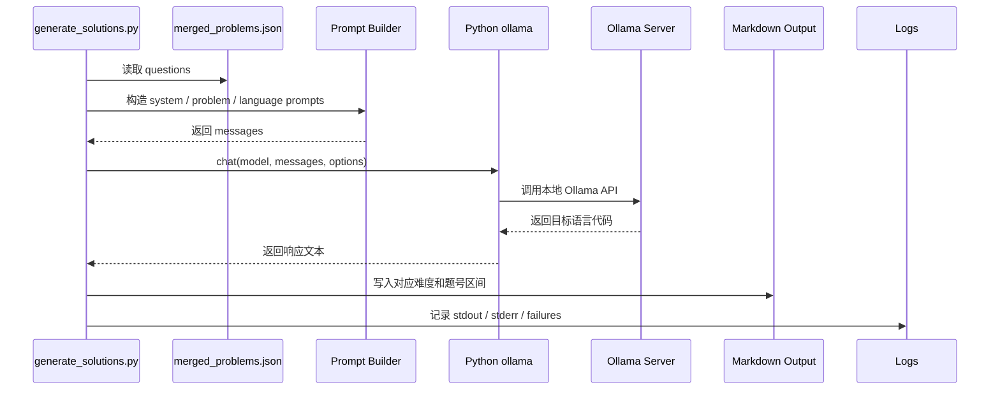
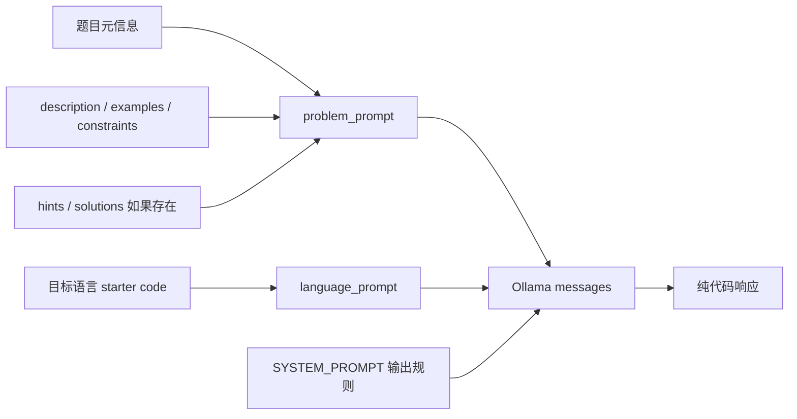
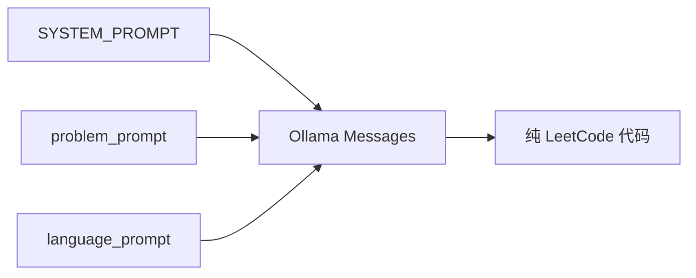

# Agent 生成流程

本文说明本项目的生成器 agent 如何调用 Ollama、如何组织 prompt、如何利用 prompt 复用，以及失败后如何继续运行。

## 生成器调用链路



生成器使用 Python `ollama` 包，而不是手写 `requests`。原因是客户端库已经处理了 Ollama API 的数据结构和响应封装，项目代码只需要关注题目、语言、输出和失败恢复。

## Prompt 到模型的边界

传给模型的内容包括题目文本信息和该语言 starter code，不包括图片。`solutions` 存在时会作为思路参考进入题目公共 prompt；不存在时直接跳过。最终输出只接受可提交代码，不接受 Markdown 代码围栏、题目复述、复杂度解释或测试入口。



## Prompt 分层



- `SYSTEM_PROMPT`: 所有题目和所有语言共享的全局要求。
- `problem_prompt`: 题目元信息、描述、示例、约束、提示和可选题解参考。
- `language_prompt`: 目标语言和该语言 starter code。

这种结构最大化 prompt 复用。同一道题切换语言时，只改变最后的语言 prompt。

## Prompt 示例

生成器实际发送给 Ollama 的 messages 是三个元素，顺序固定：

```python
[
    {"role": "system", "content": SYSTEM_PROMPT},
    {"role": "user", "content": problem_prompt},
    {"role": "user", "content": language_prompt},
]
```

`SYSTEM_PROMPT` 放全局规则，所有题目和所有语言都相同。它约束模型只输出可提交代码：

```text
You are a senior algorithm engineer and LeetCode solution generator.
Generate only the optimal accepted solution for the requested target language.
Use the provided LeetCode starter code signature and style exactly.
Return raw code only. Do not wrap the answer in Markdown code fences.
Do not include the problem statement, explanations, complexity analysis, tests,
main functions, extra I/O, pseudocode, or unsupported dependencies.
```

`problem_prompt` 放同一道题所有语言共享的上下文。以 LeetCode 1 为例，结构大致是：

```text
# Problem Context

## Problem Metadata
- title: Two Sum
- problem_id: 1
- frontend_id: 1
- difficulty: Easy
- problem_slug: two-sum
- topics: Array, Hash Table

## Problem Statement
Given an array of integers nums and an integer target...

## Examples
- example_num: 1
- example_text: Input: nums = [2,7,11,15], target = 9 ...

## Constraints
- 2 <= nums.length <= 10^4

## Editorial / Solution Reference
Hash map based one-pass lookup...
```

`language_prompt` 只放目标语言和 starter code。以 Python3 为例：

```text
Target Language: python3

Use this LeetCode starter code signature and style:

class Solution:
    def twoSum(self, nums: List[int], target: int) -> List[int]:
        pass

Generate the optimal accepted solution for this language.
Return raw code only. Do not wrap the answer in Markdown code fences.
```

输出中必须保留 `class Solution` 和 `def twoSum(...)` 这种 LeetCode 提交入口；对于 Rust、Elixir、Racket 等语言，也必须保留对应的 `impl Solution`、`defmodule Solution do` 或 `define/contract`。

## Prompt 缓存和复用

这里的缓存不是在代码里手写一个 KV cache，而是让模型服务更容易复用相同前缀。大模型推理时，输入越稳定，前缀越长，服务端越容易复用已经处理过的 token。这个项目有两个稳定前缀：

1. `SYSTEM_PROMPT`：跨所有题目、所有语言完全相同。
2. `problem_prompt`：同一道题的所有语言完全相同。

同一道题生成多语言时，请求形态如下：

```text
语言 1: SYSTEM_PROMPT + problem_prompt(0001) + language_prompt(python3)
语言 2: SYSTEM_PROMPT + problem_prompt(0001) + language_prompt(cpp)
语言 3: SYSTEM_PROMPT + problem_prompt(0001) + language_prompt(java)
```

前三段中的前两段保持不变，只有最后的语言层变化。这样比“每次把规则、题目、语言混成一整段新 prompt”更利于缓存，也更利于定位问题：如果同一道题只有某个语言失败，通常优先检查该语言 starter code 或语言输出，而不是重新怀疑题目 prompt。

换题时，`problem_prompt` 会变化，但 `SYSTEM_PROMPT` 仍然不变：

```text
题目 1: SYSTEM_PROMPT + problem_prompt(0001) + language_prompt(...)
题目 2: SYSTEM_PROMPT + problem_prompt(0002) + language_prompt(...)
题目 4: SYSTEM_PROMPT + problem_prompt(0004) + language_prompt(...)
```

这就是为什么全局规则必须尽量放进 system prompt，题目内容必须集中放进 problem prompt，语言差异必须压缩到 language prompt。

## 失败行为

每个语言最多重试三次。超过重试次数后记录失败并继续处理下一个任务单元。

失败不阻塞全量任务是有意设计：一次全量生成可能运行很久，单个语言、单道题或一次模型超时不应该让整个批处理停止。失败项会记录题号、slug、语言、重试次数和错误信息，后续可以按题号或语言做小范围重跑。

