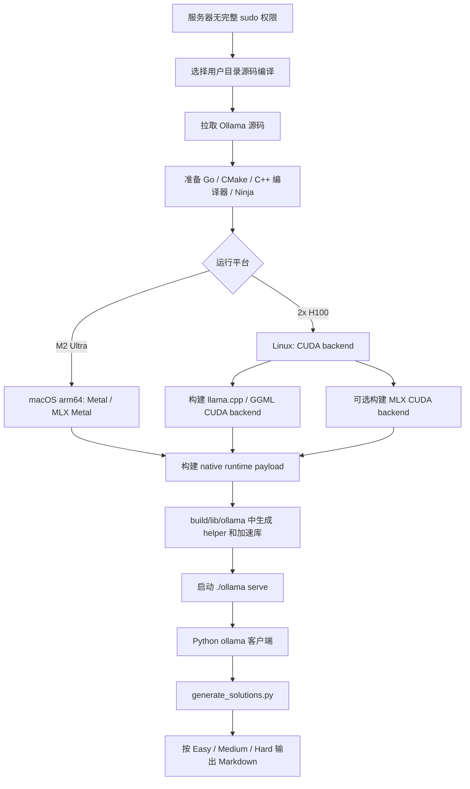

# Ollama 安装和源码编译

本文说明服务器上为什么需要源码编译 Ollama，以及 CPU、CUDA、MLX、llama.cpp / GGML、native runtime payload 这些组件在构建流程中的位置。

## 服务器源码编译

在我们的服务器上，Ollama 不只按普通安装脚本使用，而是按源码构建方式准备运行环境。最直接的原因是服务器没有完整 `sudo` 权限，不能依赖 `curl -fsSL https://ollama.com/install.sh | sh` 这种会写系统目录、安装 systemd 服务或修改系统库路径的流程。如果有完整管理员权限，直接安装官方包会更简单；当前环境需要把构建、安装和运行都控制在用户目录下。

第二个原因是 H100 节点需要明确控制 CUDA backend。Ollama 本体是 Go 项目，但推理后端不是纯 Go：它还包含 CGO、C/C++ native runtime、llama.cpp / GGML 后端、可选 MLX engine，以及按平台放置的 native helper 和 acceleration libraries。所以构建流程不是单纯 `go build`，而是 Go 层和 native payload 一起准备。

官方开发流程要求准备：

| 组件 | 作用 |
| --- | --- |
| Go | 编译 Ollama 主程序和服务入口。 |
| CMake | 配置 native runtime、后端选择和构建目录。 |
| C/C++ 编译器 | 编译 llama.cpp / GGML 等 native 推理代码。Linux 通常使用 GCC 或 Clang。 |
| Ninja | 推荐的 CMake build tool，尤其适合并行构建。 |
| CUDA SDK | NVIDIA GPU backend 所需。H100 节点使用 CUDA backend。 |
| cuDNN 9+ | 可选 MLX CUDA engine 需要。 |
| llama.cpp / GGML backend | Ollama 支持的核心推理后端之一。 |
| native runtime payload | CMake 构建后放到 `build/lib/ollama` 等目录，运行时由 Ollama 加载。 |

## 构建层次

1. **Go 层**：`go run . serve` 可以在已有 native payload 的情况下快速跑 Ollama 服务，适合改 Go 代码或验证服务入口。
2. **CPU native 层**：fresh checkout 或 native 代码变化后，用 CMake 构建完整 native runtime；Linux 默认是 CPU-only。
3. **CUDA llama.cpp / GGML 层**：在 Linux/H100 上显式设置 `OLLAMA_LLAMA_BACKENDS=cuda_v13`，让构建产物包含 CUDA 加速后端。
4. **MLX engine 层**：如果使用 safetensor/MLX 路径，再用 `OLLAMA_MLX_BACKENDS=cuda_v13`，并保证 CUDA 13+ 和 cuDNN 9+ 可用。
5. **运行时库发现层**：Ollama 运行时会查找 `build/lib/ollama`、`dist/<platform>/lib/ollama` 或安装布局中的 `lib/ollama`。如果这些 helper 和 acceleration libraries 找不到，就无法使用加速库。

官方源码构建参考：

- [Ollama development.md](https://github.com/ollama/ollama/blob/main/docs/development.md)

## NVIDIA 服务器构建

核心步骤：

```bash
git clone https://github.com/ollama/ollama.git
cd ollama

# 先确认用户目录里的工具链可用，不依赖 sudo 安装到系统目录。
go version
cmake --version
ninja --version
nvcc --version

# 构建 CUDA llama.cpp / GGML backend。
cmake -B build . -DOLLAMA_LLAMA_BACKENDS=cuda_v13 -DCMAKE_CUDA_ARCHITECTURES=native
cmake --build build --parallel 8

# 从源码目录启动本地 Ollama 服务。
./ollama serve
```

如果要启用 MLX CUDA engine，则服务器还需要 CUDA 13+ 和 cuDNN 9+，并使用 `OLLAMA_MLX_BACKENDS` 选择 CUDA backend：

```bash
cmake -B build . -DOLLAMA_MLX_BACKENDS=cuda_v13
cmake --build build --parallel 8
```

Apple Silicon 上的构建路径不同。macOS arm64 默认面向 Metal 推理；如果需要 MLX Metal，还要先安装 Xcode 和 Metal toolchain。M2 Ultra 本地工作站适合验证 prompt、日志和断点续跑逻辑；H100 节点适合长时间全量生成。



