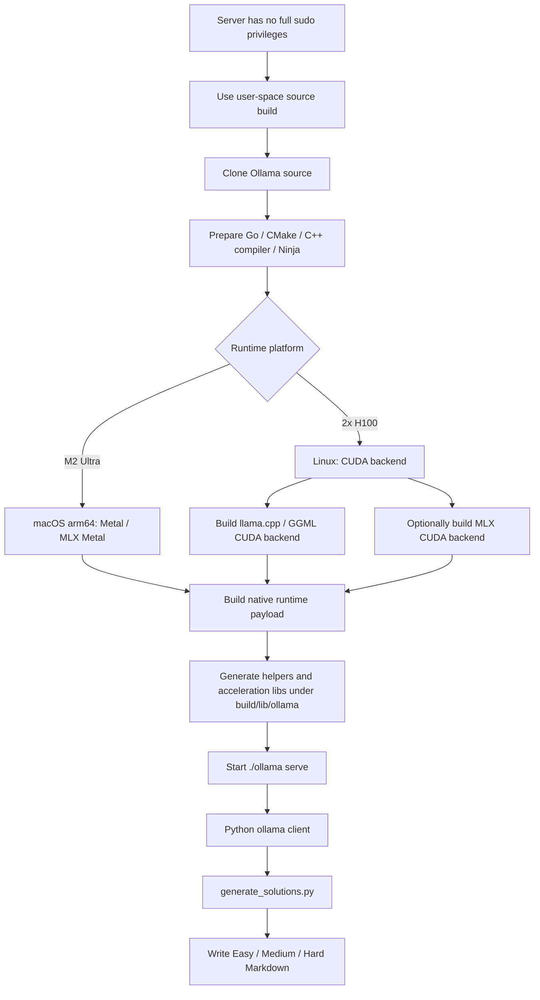

# Ollama Installation and Source Build

This page explains why the server uses a source build for Ollama, and where CPU, CUDA, MLX, llama.cpp / GGML, and native runtime payloads fit into the build flow.

## Server Source Build

On our server, Ollama is prepared from source rather than treated only as a one-line installer. The immediate reason is that the server does not provide full `sudo` privileges, so we cannot rely on `curl -fsSL https://ollama.com/install.sh | sh` writing into system directories, installing a systemd service, or changing system-level library paths. With full administrator access, the official installer would be simpler. In this environment, build, install, and runtime layout need to stay inside user-controlled directories.

The second reason is that the H100 node needs explicit CUDA backend control. Ollama itself is a Go project, but inference is not pure Go: it also includes CGO, C/C++ native runtime code, llama.cpp / GGML backends, the optional MLX engine, and platform-specific native helpers and acceleration libraries. The build is therefore not just a plain `go build`; the Go layer and native payload must be prepared together.

The official development flow requires:

| Component | Role |
| --- | --- |
| Go | Builds the Ollama main binary and service entry point. |
| CMake | Configures native runtime, backend selection, and build directories. |
| C/C++ compiler | Builds native inference code such as llama.cpp / GGML. Linux usually uses GCC or Clang. |
| Ninja | Recommended CMake build tool, especially for parallel builds. |
| CUDA SDK | Required for NVIDIA GPU backends. The H100 node uses a CUDA backend. |
| cuDNN 9+ | Required if the optional MLX CUDA engine is used. |
| llama.cpp / GGML backend | One of Ollama's core supported inference backends. |
| native runtime payload | Built by CMake and placed under paths such as `build/lib/ollama`, then loaded by Ollama at runtime. |

## Build Layers

1. **Go layer**: `go run . serve` can run the Ollama service when an existing native payload is already available. This is useful for Go-level iteration.
2. **CPU native layer**: for a fresh checkout or native-code changes, CMake builds the full native runtime. Linux defaults to CPU-only unless GPU backends are selected.
3. **CUDA llama.cpp / GGML layer**: on Linux/H100, set `OLLAMA_LLAMA_BACKENDS=cuda_v13` so the build includes the CUDA acceleration backend.
4. **MLX engine layer**: if the safetensor/MLX path is used, set `OLLAMA_MLX_BACKENDS=cuda_v13` and ensure CUDA 13+ and cuDNN 9+ are available.
5. **Runtime library discovery layer**: Ollama looks for helpers and acceleration libraries under paths such as `build/lib/ollama`, `dist/<platform>/lib/ollama`, or installed `lib/ollama` layouts. If these are missing, acceleration libraries will not be used.

Official source-build reference:

- [Ollama development.md](https://github.com/ollama/ollama/blob/main/docs/development.md)

## NVIDIA Server Build

Main steps:

```bash
git clone https://github.com/ollama/ollama.git
cd ollama

# Confirm user-space toolchain availability without relying on sudo.
go version
cmake --version
ninja --version
nvcc --version

# Build the CUDA llama.cpp / GGML backend.
cmake -B build . -DOLLAMA_LLAMA_BACKENDS=cuda_v13 -DCMAKE_CUDA_ARCHITECTURES=native
cmake --build build --parallel 8

# Start the local Ollama service from the source tree.
./ollama serve
```

If the MLX CUDA engine is used, the server also needs CUDA 13+ and cuDNN 9+, with `OLLAMA_MLX_BACKENDS` selecting the CUDA backend:

```bash
cmake -B build . -DOLLAMA_MLX_BACKENDS=cuda_v13
cmake --build build --parallel 8
```

The Apple Silicon path is different. macOS arm64 builds target Metal inference by default; MLX Metal requires Xcode and the Metal toolchain. The M2 Ultra workstation is useful for validating prompts, logs, and resumable generation. The H100 node is the long-running full-generation target.



